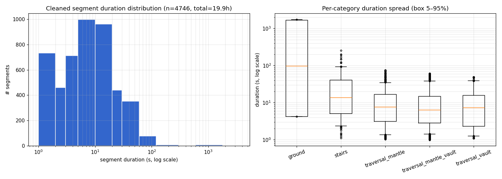

# MorphData_v1 preprocessing — dt-gap + disp/dt-speed cleaning

> ⚠️ **Run this before retargeting/training.** The raw MorphData_v1 captures
> contain two pervasive logging/capture artifacts that poison downstream
> motion: ~47% of all raw frames are stuck duplicate frames, and the rest is
> fragmented by 200k+ big capture gaps. Skipping this step feeds phantom
> velocities, 0.1 s+ holes, and 70+ m/s teleport spikes into the retargeting
> IK and any model trained on the data. See the before/after tables below.

This directory contains the offline cleaning pipeline used to produce the
cleaned MorphData_v1. It is a **non-destructive, reversible** two-stage
process: `clean_morph.py` *stages* cleaned segments without touching the
originals, then `apply_clean.py` swaps them in (with a full backup and a
rollback manifest). `eval_clean.py` and `seg_duration_dist.py` verify the
result.

## Files

| file | purpose |
|---|---|
| `clean_morph.py` | Core cleaner. Classifies every frame, drops stuck/glitch frames, splits at big gaps & teleports, interpolates small gaps, renumbers `t/dt/f`, and stages kept segments. |
| `apply_clean.py` | Replaces changed originals with their staged cleaned segments. Backs up originals and writes a rollback manifest. |
| `rollback_clean.py` | Undoes an `apply_clean.py` swap using the rollback manifest. |
| `eval_clean.py` | Evaluates a dataset: `disp/dt` speed thresholds, `dt` distribution, per-category duration. Run before **and** after cleaning. |
| `seg_duration_dist.py` | Duration distribution of the cleaned segments (percentiles, histogram, PNG). |
| `browse_clean.py` | Interactive MuJoCo G1 viewer that retargets each cleaned segment on the fly and lets you **jump between trajectories** with `N`/`P` keys (one persistent viewer, no re-launch per clip). |
| `assets/seg_duration_dist.png` | Duration-distribution plot for the cleaned v1 set. |

## Cleaning rules (per frame `k`, with a predecessor)

```
dt < 0.005s            -> stuck frame: drop (dedup)
dt > 0.1s              -> big gap: SPLIT point (keep k as new segment start)
0.05 < dt <= 0.1s      -> small gap: keep k, interpolate missing frames
0.005<dt<0.05 and disp/dt>10 m/s -> mutation:
     return-speed |p[k+1]-p[k-1]|/(t[k+1]-t[k-1]) < 10 m/s -> glitch: drop k
     else                                              -> teleport: SPLIT point
else                   -> normal: keep
Segment filter: keep if n_frames >= 60 AND sum(dt) >= 1.0s
```

* `dt` is always the **real** `t[k]-t[k-1]` (never the assumed 1/60), so stuck
  frames with `dt≈1e-5` are caught instead of inflating speed.
* `disp/dt = |root.p[k]-root.p[k-1]| / dt / 100` (m/s; `root.p` is UE cm).
  This measures **actual root displacement**, which is robust to the engine's
  phantom `phy.v` spikes (high `phy.v` with ~0 displacement) and also catches
  kinematic position corrections that `phy.v` does not reflect.
* The 10 m/s mutation threshold is the natural gap between real motion
  (envelope ≤ ~7.5 m/s) and noise spikes (≥ 10 m/s, always 1–3 frame needles).

## Usage

From the `Morph/` directory:

```bash
# 1. Stage cleaned segments (originals untouched). Writes a manifest + stats.
python DataLib/preprocess/clean_morph.py \
    --data-root data/MorphData_v1 \
    --out-root  data/MorphData_v1_cleaned_staging

# 2. Evaluate the RAW dataset first (baseline), then the staging dir, or
#    evaluate in-place after applying. Here we evaluate the raw set:
python DataLib/preprocess/eval_clean.py --data-root data/MorphData_v1

# 3. Swap staged segments into the dataset (originals backed up).
python DataLib/preprocess/apply_clean.py \
    --data-root data/MorphData_v1 \
    --stage-root data/MorphData_v1_cleaned_staging \
    --backup-dir data/MorphData_v1_originals_backup

# 4. Evaluate the cleaned dataset in place.
python DataLib/preprocess/eval_clean.py --data-root data/MorphData_v1

# 5. Duration distribution of the cleaned segments.
python DataLib/preprocess/seg_duration_dist.py --data-root data/MorphData_v1

# Rollback if needed:
python DataLib/preprocess/rollback_clean.py --data-root data/MorphData_v1
```

All paths are CLI-configurable; defaults are relative to the `Morph/` root.
Tunables (`--stuck-dt`, `--big-gap-dt`, `--small-gap-dt`, `--mut-mps`,
`--min-frames`, `--min-dur`) expose the rules above.

### Browsing the cleaned segments (interactive viewer)

`browse_clean.py` reuses the MORPH retarget pipeline to replay every cleaned
segment as a G1 in one persistent MuJoCo viewer, with keys to **jump between
trajectories** instead of one clip per launch:

```bash
# Browse one category (N = next clip, P = previous, Space = play/pause)
python DataLib/preprocess/browse_clean.py --cat traversal_mantle

# Cap / shuffle the playlist
python DataLib/preprocess/browse_clean.py --cat ground --limit 20 --shuffle

# Browse all categories back-to-back
python DataLib/preprocess/browse_clean.py --all
```

Keys: `Space`=pause, `Left/Right`=step, `Backspace`=reset, **`N`=next
trajectory**, **`P`=previous**, `T`=toggle trajectory overlay, `O`=toggle
orientation arrows, `V`=toggle velocity arrows, `Esc`/`Q`=quit. The next
segment is retargeted in a background thread while the current one plays, so
jumping with `N` is usually instant.

A checkerboard **ground plane** is always shown. Add **terrain** with
`--terrain-dir`: each clip's terrain (from its meta `terrain_ref`) is baked
into the scene through the same transform pipeline as the motion. In terrain
mode the viewer relaunches per clip so the terrain matches (the next clip is
pre-retargeted in the background, so `N` is still fast). The full terrain set
is not vendored — extract `MorphDataTerrain_v1.zip` into a folder and point
`--terrain-dir` there. (`stairs` works with the shipped
`data/sample/terrain/`; `traversal_*` need the full set; `ground` has no
terrain and shows ground only.) Requires a display and the `mujoco`/`mink`/
`scipy` runtime deps.

## Results on MorphData_v1 (v1)

### Cleaning stats

| metric | value |
|---|---:|
| input files (segments) | 1,858 |
| input frames | 8,546,577 |
| **output segments** | **4,746** |
| **output frames** | **4,257,710** (49.8% retained) |
| dropped stuck frames (dt<0.005) | 4,058,815 |
| deleted glitch frames | 9,007 |
| big-gap split points (dt>0.1) | 213,627 |
| small-gap interpolated (0.05<dt<=0.1) | 2,361 |
| total segments generated | 215,485 |
| dropped segments (<60 frames or <1s) | 210,739 |
| unchanged files | 15 |

Two key findings:

* **47% of frames are stuck frames** (dt≈1e-5, identical position) — a logging
  artifact of writing multiple frames per engine tick. Dropping them loses no
  motion information.
* **The data is heavily fragmented by big gaps** — 213,627 gaps of dt>0.1 s
  cut the data into 215,485 segments, of which 210,739 are sub-second shards
  that fail the segment filter (costing ~20.8 h).

### Before vs after (disp/dt real displacement speed)

| metric | before | after | change |
|---|---:|---:|---|
| segments | 1,858 | **4,746** | +2,888 (split) |
| total frames | 8,546,577 | **4,257,710** | −4,288,867 (−50%, mostly stuck dupes) |
| total duration | 40.68 h | **19.86 h** | −20.82 h (−51%, mostly <1s shards dropped) |
| stuck frames (dt<0.005) | many | **0** | eliminated ✓ |
| big gaps (dt>0.1) | 213,627 | **0** | eliminated ✓ |
| small gaps (0.05<dt<=0.1) | — | 25 | residual stitched gaps (<0.1, not split by rule) |
| global max dt | 5.67 s | **0.066 s** | no big gaps ✓ |
| per-segment median dt | ~0.013–0.017 | **0.015 s** | back to ~1/60 ✓ |
| disp/dt speed peak | 74.3 m/s | **13.4 m/s** | large drop ✓ |
| >10 m/s frames | — | **3** | only small-gap boundary frames (kept by rule) |
| >15 m/s frames | many | **0** | ✓ |

Threshold hits after cleaning (disp/dt real speed):

| speed threshold | frames hit |
|---|---:|
| > 6 m/s | 39,560 |
| > 8 m/s | 5,633 |
| > 10 m/s | 3 |
| > 15 m/s | 0 |
| > 20 m/s | 0 |
| > 30 m/s | 0 |

### Per-category distribution after cleaning

| category | segments | frames | hours | disp/dt peak (m/s) |
|---|---:|---:|---:|---:|
| ground | 21 | 840,406 | 3.90 | 8.2 |
| stairs | 230 | 380,699 | 1.79 | 10.0 |
| traversal_mantle | 1,588 | 1,104,080 | 5.13 | 10.0 |
| traversal_mantle_vault | 1,950 | 1,310,826 | 6.14 | 10.0 |
| traversal_vault | 957 | 621,699 | 2.91 | 13.4 |
| **total** | **4,746** | **4,257,710** | **19.86** | — |

### Duration distribution of the cleaned segments (n=4,746, 19.86 h)

| bin (s) | segments | % |
|---|---:|---:|
| <1 | 1 | 0.0% |
| 1–2 | 733 | 15.4% |
| 2–3 | 459 | 9.7% |
| 3–5 | 712 | 15.0% |
| **5–10** | **996** | **21.0%** |
| 10–20 | 962 | 20.3% |
| 20–30 | 439 | 9.2% |
| 30–60 | 351 | 7.4% |
| 60–120 | 77 | 1.6% |
| 120–300 | 7 | 0.1% |
| 300–600 | 1 | 0.0% |
| 600–1800 | 8 | 0.2% |

Percentiles: p1=1.11s, p5=1.36s, p10=1.51s, p25=2.97s, **p50=7.29s**,
p75=15.96s, p90=28.95s, p95=41.15s, p99=67.43s; min=1.00s, max=1750.15s,
mean=15.07s. The distribution is bimodal + long-tailed: primary peak 5–20 s
(41%), secondary peak 1–3 s (25%), long tail to ~29 min (all from `ground`).



## Notes / tuning

* The 3 residual >10 m/s frames are boundary frames of small (0.05–0.1 s)
  gaps, which the rule interpolates rather than splits. They are
  3/4.26M ≈ 0.00007% of frames. To zero them out, make "small gap **and**
  disp/dt>10" a split point too.
* The 51% duration loss is dominated by sub-second shards being dropped
  (210,739 segments). To keep more short actions, lower `--min-frames` (e.g.
  30) or `--min-dur` (e.g. 0.5), or interpolate 0.1–0.5 s gaps instead of
  splitting them.
* Rollback: originals are fully backed up; `rollback_clean.py` restores them.
